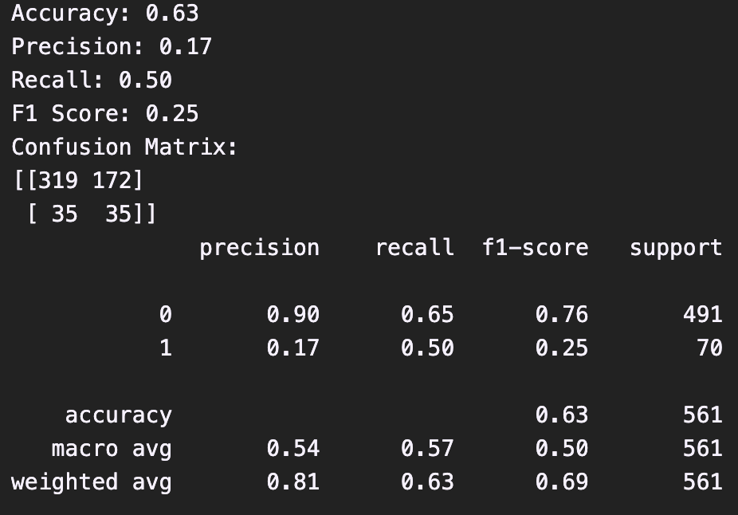
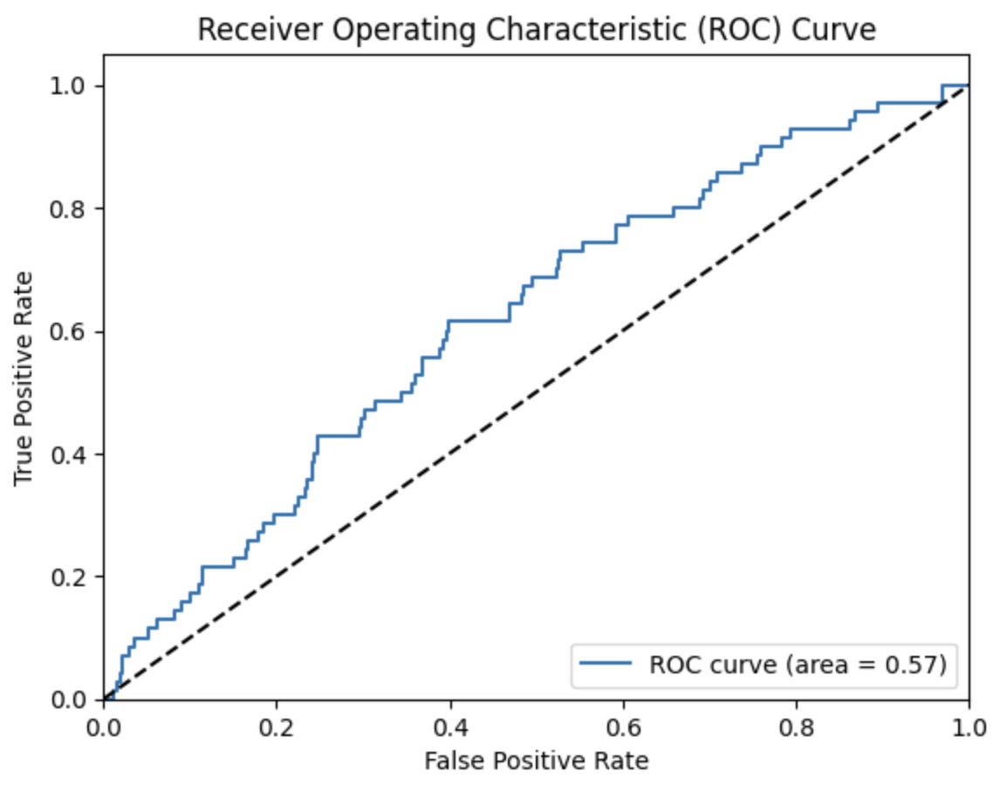
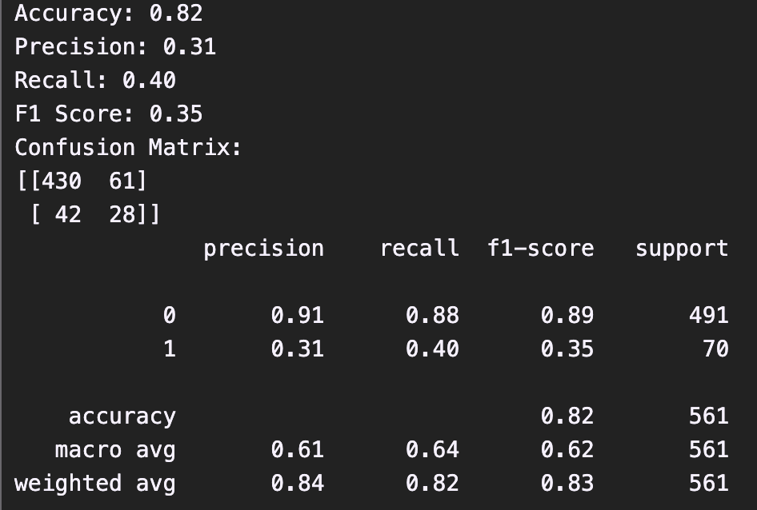
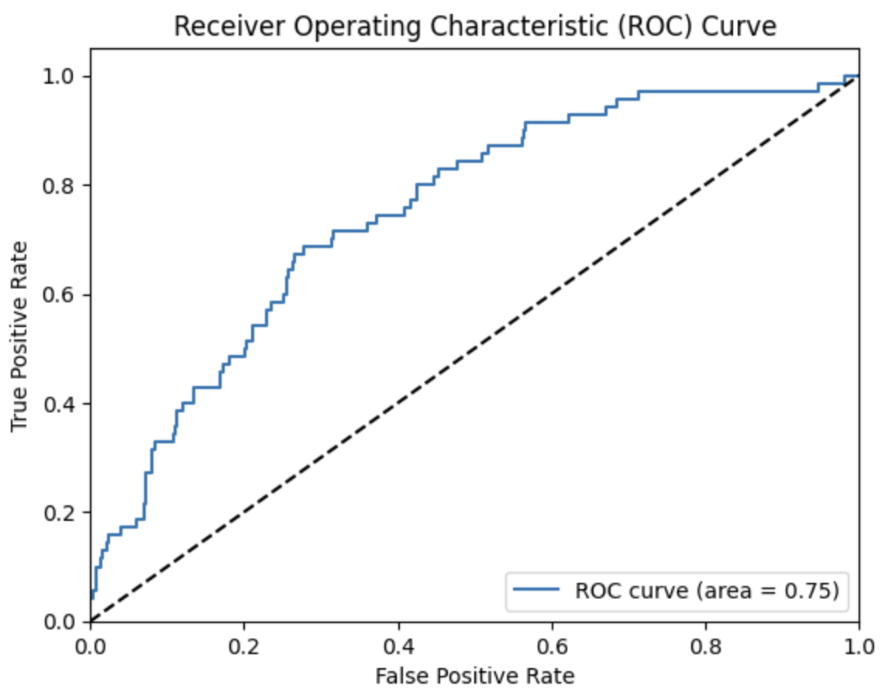
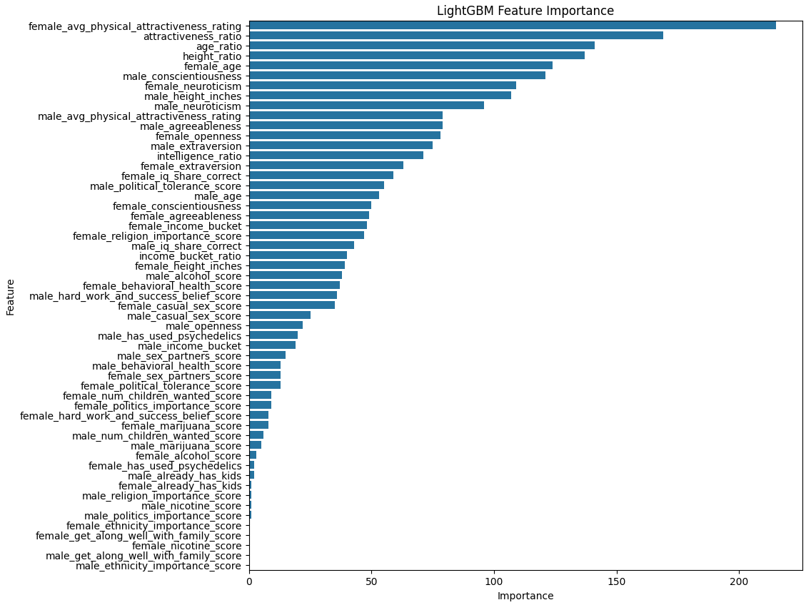

# Introduction
Finding a suitable mate is a problem as old as sexual reproduction. Throughout times multiple approaches have emerged to attempt to solve this problem. Here we are trying to tackle it with the power of machine learning.

The application domain is speed-dating and matchmaking. We are trying to predict if a man and a woman will experience mutual interest during an eight minute speed-dating interaction.

First we will briefly formulate the problem. The next section will discuss the dataset, followed by the methods used. Then we will go over feature selection and engineering, as well as the train-test split. We will finish up with results and evaluations, then conclude with a conclusion.

**The outline of this report will be as follows:** 
- Problem formulation
- Few remarks on the dataset
- Method(s) used
- Feature selection and engineering
- Train-test split
- Results and Evaluations
- Conclusion
- Appendices
# Problem formulation
The problem statement goes as follows: given data about a male and a female, can we predict whether they are going to experience mutual interest in each other (during an 8-minute speed dating interaction, since that is what the dataset is collected on). 

## On the dataset
[The dataset used](https://github.com/dankras/mixmosa-anonymized-data) (Kras 2022) originates from a now defunct matchmaking/speed-dating service Mixmosa. During it's operation, they collected data about their users and the interactions between the them. They have released their (anonymised) dataset, since it could be of interest for various research efforts. [Here](https://dkras.substack.com/p/sex-differences-attractiveness-and) (Kras 2022) is some basic exploration of the dataset.

Here are all the columns from the dataset. All of these were used in the model training except for ethnicity, religion and politics, as they are censored, as well as gender and attracted_to, as they are categoric. The rest of the data is numeric, or categoric encoded as numeric.

**So the fields used are:**
age, iq_share_correct, agreeableness, conscientiousness, extraversion, neuroticism, openness, avg_physical_attractiveness_rating, height_inches, income_bucket, nicotine_score, alcohol_score, marijuana_score, has_used_psychedelics, behavioral_health_score, sex_partners_score, get_along_well_with_family_score, political_tolerance_score, ethnicity_importance_score, religion_importance_score, politics_importance_score, num_children_wanted_score, already_has_kids, casual_sex_score, hard_work_and_success_belief_score.

**There is a lot to cover here, and as more about each field (clear descriptions for what they represent) can be read from the [Github page](https://github.com/dankras/mixmosa-anonymized-data) (Kras 2022) containing the dataset, I don't find it reasonable to just repeat what is already stated there.**

Each datapoint will be constructed as these features for the male combined with the same things for the female, then add some custom features, and use mutual interest during the interaction as the label. Then each datapoint essentially represents data about the participants of the interaction with the mutual interest as the label.

**size**
The dataset is fairly comprehensive, containing data on almost 3000 interactions of around  4000 participants. Unfortunately once you remove the ones where some of the data for at least one of the participants is missing, we are only left with 1121 interactions (datapoints), which should still be sufficient.

**Imbalance**
The dataset is also really imbalanced, with only 12,5% of the (usable) interactions having mutual interest. 
## Methods
My method of choice for the first part of the assignment was supervised learning with logistic regression. The goal was to just do something quick and simple to see whether this is a problem where machine learning can be useful. Logistic regression is perfect for this task as it is simple and suitable for what I'm trying to achieve here (predict binary outcomes from tabular data). The goal also was to get a baseline performance against which some more advanced methods (LightGBM) can be compared against during the second part of the assignment.

One thing of note is that due to the imbalanced dataset, class_weight='balanced' was used. The effect it had (compared to not using it) was a great improvement on the recall for the positive case.

The loss function used here is the basic log loss. It is standard with logistic regression, so nothing special there in need of justification. Just to have some reasoning, I'll refer to the grading criteria: “The logistic loss is chosen as it allowed the use of a ready-made library for logistic regression”

Evaluating the logistic regression model was done by computing the accuracy, confusion matrix, and various scores like precision, recall and F1. Also ROC-AUC was plotted. Test error will be computed as 1 - accuracy. It essentially tells the share of predictions that were incorrect and makes for easy comparison across methods.

As previously mentioned, for the second part I decided to go with LightGBM. The reason is that it is state of the art when it comes to supervised learning with tabular data. It can better handle the large amount features, their interrelations and various non-linearities present in the dataset, and thus get better results. When training the LightGBM model, a fairly extensive hyperparameter search was conducted to find the optimal combination.

Loss function used with LightGBM was log loss as well, as it is what LightGBM uses by default on binary prediction tasks. The same evaluation metrics were computed for LightGBM as was for logistic regression (test error included).

F1 of the positive case is the main metric we will focus on most when testing the models. The reasoning is outlined in section "Results and evaluations".
## Feature selection
Most of the features used are simply the features of the participants taken directly from the dataset. These include things like: age, height, some form of intelligence score, big 5 personality trait scores, physical attractiveness as evaluated by an external committee, income bucket and various preferences among other things. Basically the things covered in the dataset section. Since a single interaction has two participants, each of these features will be represented twice. One for the male and one for the female.

Everything usable that the dataset had to offer was added as a feature, as there was a lot of uncertainty regarding the usefulness of each. The methods used and the motivations to use them also played into that decision. In the first phase, using logistic regression, the idea was to simply explore and experiment. In the second phase with LightGBM there also was no need to prune any features as the model itself is pretty capable of choosing what is useful and what isn't.

I also made some basic custom features that track some feature of the male in relation to that of the female's, for example the ratio of their ages or height. The intuition was that the absolute values might not be the whole story, but how they interrelate is probably of greater importance (not that the absolutes don't matter as well). So essentially, the features used are the ones directly from the dataset (for both male and female) and some simple ratios that could be helpful. They were all also standardised before training the model. 

Labels are: 1 for mutual interest during the 8 minute interaction, 0 for not.
## Train-Test split
I ended up choosing a 50/50 train-test-split. It was constructed using train_test_split with random seed 42. The sizes are 560 and 561 datapoints for train and test respectively. In the previous part of the project the split was 70/30. I chose to increase the amount of test data as previously there was a shortage and per my quick experimentation, the smaller training set didn't seem to significantly degrade performance on neither model, indicating that the models are not data constrained in this case. There also wasn't a need for an explicit validation set, as logistic regression is simple and can do without, and a stratified (uniform distribution of classes across folds) k-fold cross-validation was used with LightGBM to tune the hyperparameters, where k was set to 3.
## Results and evaluations
Love is very complex and it would account as hubris to hope to predict it perfectly. What we are simply after is an improvement over the baseline. As we are trying to find suitable matches, the positive case is the one we care about most. 

A naive baseline method could be predicting positive mutual interest for all pairings and thus choosing the interactions randomly. That would achieve a precision of 0.125 (the fraction with mutual interest) and a recall of 1.0 (as it would catch all of them). So with the naive baseline every eighth speed-date would be a success. The error for the naive baseline is 1-0.125=0.875

In our model evaluations, what matters most is F1 for the positive case with maybe some bias towards precision. The reasoning goes as follows: as each individuals time, energy and patience is limited, you only want to provide them with interactions that have as high a probability of being successful as possible. But you also need to make sure that there still is a sufficient number of interactions for each (enough that finding a good match is likely).

A reduction in recall isn't too harmful as long as there still is a sufficient number of potential pairings (interactions where the model predicts a positive case), since even after event organisers run out of those, they can just continue by choosing randomly. Of course ideally there would be just as many potential pairings (model predicts positive) for each participant as they have time, energy and patience for. 

Below are the metrics the models achieved.

**For logistic regression we got the following metrics**

Here we can see a minor improvement on the precision over the naive baseline (0.17 vs. 0.125), while the recall suffered a lot (0.5 vs. 1.0). However there are still plenty of cases where the model predicts positive.

The error was 1-0.63=0.37. A great improvement over the naive baseline.

**ROC-AUC for Logistic Regression**

*Shows that the model is at least a tiny bit predictive.*

**Here are the metrics for LightGBM**

With LightGBM we achieved an improvement over Logistic Regression on all metrics except for recall for the positive case. However, as outlined above that isn't a big issue, and 0.40 is still sufficient.

The precision for the positive case is fairly good here. It is a 2.5x improvement over the naive baseline, and overall indicates that almost a third of the positive cases are successful.

The error was 1-0.82=0.18. A great improvement over logistic regression.

**The ROC-AUC for LightGBM**

*Here we can see clear improvement over logistic regression.*

**Also as a curiosity, the feature importances for LightGBM.**

*Here we can see that the custom features I crafted turned out to be quite valuable.*
## Conclusion
While both models improved upon the baseline (guessing mutual interest for all interactions), LightGBM showed much greater improvement, and thus we decided to go with it. All in all, the test error on LightGBM was 0.18 (1-accuracy).

The results can ultimately be summarised as: 0.31 precision on the positive case while still having a reasonable recall (0.40). While this greatly improves over the baseline, it still leaves a lot of room for improvement. There might be some additional data about the participants that could be very predictive or some engineered features that might improve performance. The amount of data didn't seem to be a constraint, as reducing the size of the training set didn't have significant impact on model performance (1-2 percentage point improvement for both precision and recall with 40% more training data). It is also good to remember that attraction is a complex mechanism and perfect results are difficult to achieve.

Some caveats for real-world applications include generalisation to out of sample data. It could be that there is something special about the subset of population that the data was collected on (for example Mixmosa operated in Texas. It could be that Texasians are more interested in female physical attractiveness than the general population). This could be solved by collecting data that is more representative of the population the model will be applied on. A non-uniform distribution of predicted positive cases could also be a problem. It could be that model predicts an outsized amount of positive interactions for only a few individuals (for example young and attractive females, since most men would likely be interested, and that solves one side of the equation) and less for others. But that is not a problem with the model per se, but instead with the underlying world. The model simply tries to predict mutual interest.

## References
Kras, D. (2022). Mixmosa Anonymized Data. GitHub. Available at: https://github.com/dankras/mixmosa-anonymized-data (Accessed: 2 October 2023)

Kras, D. (2022). Insights from 2,961 First Dates. Substack. Available at: https://dkras.substack.com/p/sex-differences-attractiveness-and (Accessed: 2 October 2023)

